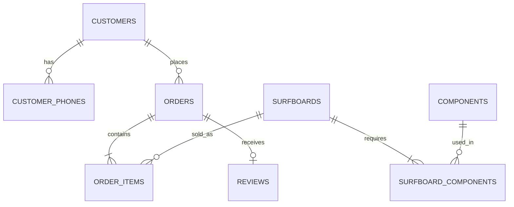

# Surfside Surfboards Database

A normalized MySQL database for a surfboard retailer that needs to manage customers, board models, fixed component bills of materials, orders, reviews, sponsorship candidates, veteran eligibility, and quarterly operating analysis.

**Created by Kristofor Figueiredo.** The original Surfside Surfboards concept and business rules were developed as a West Virginia University database design project. This repository contains a clean SQL implementation reconstructed from that original brief in 2026.

> All included customer, phone, order, and review records are synthetic demonstration data. No real customer or client data is included.

## What the design supports

- Customers with zero or many orders
- Multiple phone numbers per customer
- Independent veteran and professional-surfer attributes
- Company-defined surfboard models with fixed component recipes
- Reusable components across multiple board models
- Orders containing multiple board models and quantities
- Historical sale-price snapshots
- One optional 1–5 star review per order
- Quarterly top-customer, best-seller, and review follow-up analysis

## Data model



The model uses eight base tables and two reporting views. Component costs are calculated from the fixed bill of materials; order revenue uses the price captured when each sale occurred.

## Repository map

| Path | Purpose |
|---|---|
| `sql/01_schema.sql` | Tables, constraints, indexes, relationships, and views |
| `sql/02_seed.sql` | Clearly labeled synthetic demonstration records |
| `sql/03_analytics.sql` | Quarterly management and eligibility queries |
| `sql/04_validation.sql` | Read-only integrity checks |
| `docker-compose.yml` | Reproducible local MySQL 8.4 environment |
| `index.html` | Interactive schema reference for GitHub Pages |

## Run locally

Docker is the simplest option:

```bash
cp .env.example .env
docker compose up -d
docker compose exec mysql mysql -uroot -p"$MYSQL_ROOT_PASSWORD" surfside
```

The initialization scripts run in filename order the first time the database volume is created. To run the analytics after connecting:

```sql
SOURCE /docker-entrypoint-initdb.d/03_analytics.sql;
SOURCE /docker-entrypoint-initdb.d/04_validation.sql;
```

To stop the database:

```bash
docker compose down
```

Add `-v` only when you intentionally want to remove the local database volume and rebuild from the seed scripts.

## Design decisions

- `customer_phones` resolves the multivalued phone-number requirement.
- Nullable `veteran_id` and `pro_global_ranking` allow either, both, or neither classification.
- `surfboard_components` resolves the many-to-many relationship between boards and reusable components.
- `order_items.unit_price` preserves historical revenue independently of later cost changes.
- Reviews reference orders, so the reviewing customer is always the customer who placed that order.
- Cancelled and refunded orders are excluded from revenue and best-seller analysis.

## Authorship

Database concept, business rules, schema design, SQL implementation, analytics queries, and documentation by **Kristofor Figueiredo**. No collaborators were named in the surviving source brief.
